<b>🇪🇸 Español</b>

**Marcela González Arias · @Margoar**  
👩🏻‍💻 Backend Developer / Software Engineer · Desarrolladora backend en **PuntoTicket**

## 🛠️ Con qué trabajo

| Área | Herramientas |
| --- | --- |
| Backend | C# · .NET / .NET Core · APIs REST · Node.js · NestJS |
| Datos | SQL Server · PostgreSQL · Dapper · Entity Framework · Stored Procedures · Redis |
| Frontend | Angular · React · JavaScript · TypeScript |
| Cloud e infraestructura | Azure · GCP · Docker · Kubernetes |
| Calidad y operación | Testing · Logging y observabilidad · Git / GitHub |

## 🌸 Mi GitHub, en números
## 📊 GitHub Stats

  <picture>
    <source media="(prefers-color-scheme: dark)" srcset="https://github-readme-stats.vercel.app/api?username=Margoar&show_icons=true&hide_rank=true&card_width=330&locale=es&custom_title=Mi%20GitHub%2C%20en%20n%C3%BAmeros&bg_color=35,2b2030,221c33&title_color=f4a8c9&text_color=e6dcee&icon_color=c7a6f2&border_color=4a3652&border_radius=14">
    
  </picture>
  &nbsp;
  <picture>
    <source media="(prefers-color-scheme: dark)" srcset="https://github-readme-stats.vercel.app/api/top-langs/?username=Margoar&layout=compact&langs_count=4&hide=html,css&card_width=330&custom_title=Lenguajes%20que%20m%C3%A1s%20uso&bg_color=35,2b2030,221c33&title_color=f4a8c9&text_color=e6dcee&icon_color=c7a6f2&border_color=4a3652&border_radius=14">
    
  </picture>

Números reales, sin maquillaje. Lo de PuntoTicket vive en repos privados, así que aquí no aparece.

<b>🇬🇧 English</b>

**Marcela González Arias · @Margoar**  
👩🏻‍💻 Backend Developer / Software Engineer · Currently building backends at **PuntoTicket**

I work on the part of software where "the user buys a ticket" turns into twenty business rules, three validations, one transaction, and an edge case nobody mentioned in the meeting.

## 🛠️ What I work with

| Area | Tools |
| --- | --- |
| Backend | C# · .NET / .NET Core · REST APIs · Node.js · NestJS |
| Data | SQL Server · PostgreSQL · Dapper · Entity Framework · Stored Procedures · Redis |
| Frontend | Angular · React · JavaScript · TypeScript |
| Cloud & infrastructure | Azure · GCP · Docker · Kubernetes |
| Quality & operations | Testing · Logging & observability · Git / GitHub |

## 🌸 My GitHub, in numbers

  <picture>
    <source media="(prefers-color-scheme: dark)" srcset="https://github-readme-stats.vercel.app/api?username=Margoar&show_icons=true&hide_rank=true&card_width=330&custom_title=My%20GitHub%2C%20in%20numbers&bg_color=35,2b2030,221c33&title_color=f4a8c9&text_color=e6dcee&icon_color=c7a6f2&border_color=4a3652&border_radius=14">
    
  </picture>
  &nbsp;
  <picture>
    <source media="(prefers-color-scheme: dark)" srcset="https://github-readme-stats.vercel.app/api/top-langs/?username=Margoar&layout=compact&langs_count=4&hide=html,css&card_width=330&custom_title=Languages%20I%20use%20most&bg_color=35,2b2030,221c33&title_color=f4a8c9&text_color=e6dcee&icon_color=c7a6f2&border_color=4a3652&border_radius=14">
    
  </picture>

Real numbers, no filters. My PuntoTicket work lives in private repos, so it doesn't show up here.

